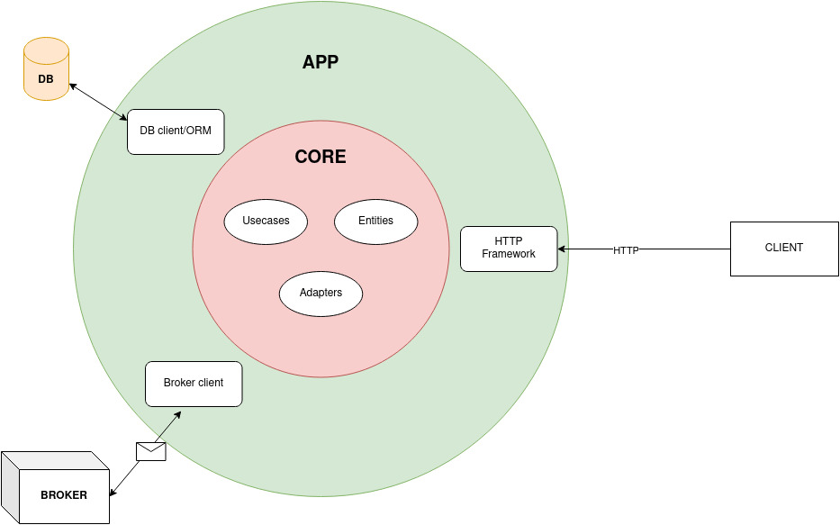
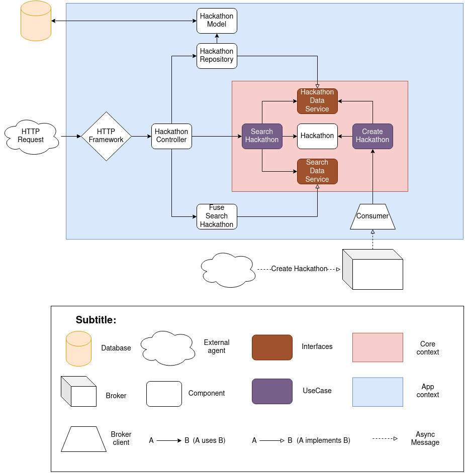

# Search Hackathon Service

This microservice is responsible for searching hackathons.

## Technologies/Libraries

- [Express.js](https://expressjs.com/): A javascript framework to handle with HTTP requests/responses.
- [Fuse.js](https://fusejs.io/): A javascript library to apply fuzzy search
- [Mongoose](https://mongoosejs.com/): A MongoDB ODM for javascript
- [Kafka-node](https://github.com/SOHU-Co/kafka-node): A kafka client for node.js

## Architecture

This services implements (or try to implement) a clean architecture by Uncle Bob.

### Overview

### Components view

The picture below shows the relationship between the service components.

